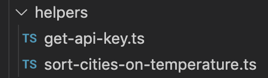
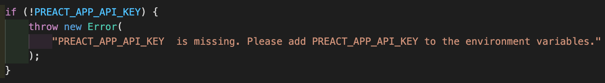

# Ikitai - Find your next destination

Ikitai (いきたい) is Japanese for expressing **the desire of going somewhere**. Don't know where you wanna go? Use this decision making tool and you'll be traveling soon ✈️

Check out the live project at [https://ikitai.netlify.app/](https://ikitai.netlify.app/)

## Getting started

```
git clone https://github.com/danielleklaasen/ikitai.git

cd ikitai

npm install

npm run dev
```

### CLI Commands overview

-   `npm install`: Installs dependencies

-   `npm run dev`: Run a development, HMR server

-   `npm run serve`: Run a production-like server

-   `npm run build`: Production-ready build

-   `npm run lint`: Pass TypeScript files using TSLint

-   `npm run test`: Run Jest and Enzyme with
    [`enzyme-adapter-preact-pure`](https://github.com/preactjs/enzyme-adapter-preact-pure) for
    your tests

For detailed explanation on other Preact CLI commands, checkout the [CLI Readme](https://github.com/developit/preact-cli/blob/master/README.md).

## This project is build with:

-   ### [Preact](https://preactjs.com/) + TypeScript

    Less is more. Or actually not really, in this case _less_ is only 3kB.

-   ### [Rebass](https://rebassjs.org/)
    A lightweight UI toolkit, in combination with [emotion-theming](https://emotion.sh/docs/theming). It enables for great performance since it generates css classes for you. Just pass in your styles throught the `sx` prop and you're ready to go.

## Highlights

### Scalable design system

Ready for a scalable design system due to the implementation of [emotion-theming](https://emotion.sh/docs/theming). See the `src/style/theme.tsx` file for an example.

### Modularity

To support reusability and ease of implementing unit tests.



### DX



## Missing elements

There are some missing elements, like:

-   **Big missing part is that sorting the results ascending or descending on temperature is not dynamic**. But the app is completely ready for it. Passing on the props through routing isn't a very neat solution, so adding some state management would be benefical in order to pass on the choice in the first screen.

-   Ticket prices are hard coded and there is done nothing with them yet. With a small adjustment the sorting mechanism that is in place can be reused.

## Future improvements

Next steps would be the following:

-   Implement something like [Axios](https://github.com/axios/axios) to fetch data properly. Also use services for making API connections.
-   Implement layer around Rebass UI kit. To avoid applying styling tweaks to Rebass components on multiple places.
-   Make the decision making tool a little smarter with more data :)
-   Play around with an AI solution and human feedback to see if users liked the location that was recommended to them (making the AI system smarter).
